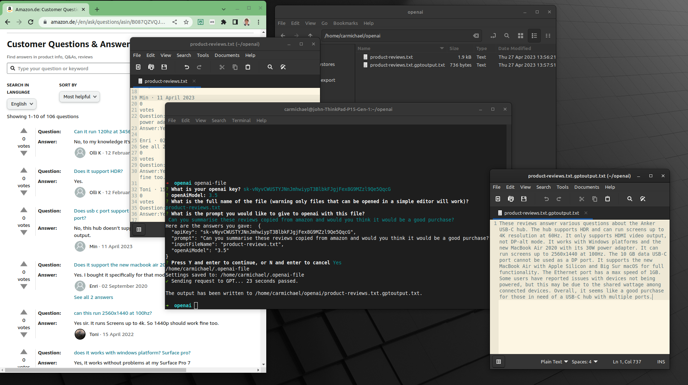

# openai-file

## What

A tool that reads a txt file and asks for an openai prompt, model to use and api key.

The tool then passes this data to the openai API.

The output is written to the same location as the input file with "gptoutput.txt" appended.

## Screenshot and some words to explain
What happened below on the 1st run:
1. Created a folder to put my txt files in.
2. Copy and pasted a load of amazon reviews from a product into a .txt file called "product-reviews.txt"
3. I then opened a terminal and navigated to the folder mentioned in step 1 and ran this program by typing "openai-file"
4. I followed each prompt pressing enter after each
5. This program then wrote the reponse from openai to disk to a file called "product-reviews.txt.gptoutput.txt"

Try run it again with another prompt:
1. With the terminal still open in the folder run the openai-file program again
2. This time add a new prompt but for the same file "Write a new 5 star review"
3. The output will be written to disk again as "product-reviews.txt.gptoutput(1)txt"

You can continue like this forever, but don't forget the input is capped depending on which API you use. GPT4 can accept approx. 25k words.

You might need to request access to GPT4.

## How to install (simple for anyone)

1. Install Nodejs: https://nodejs.org/en
2. Install this package globally
   1. Open a terminal
   2. Add this command and press enter: `sudo npm i -g openai-file`
   3. It will ask for your password and then install this openai-file program for you to use

## How to use

1. Create a folder somewhere on your computer to contain some txt files that you want to pass to GPT
2. Create a txt file eg "myfirst.txt" file
3. Add some content to the txt file eg, copy and paste this readme file into it.
4. Open a terminal and make sure it is at the location of your folder.
5. Run the tool, `openai-file`
6. Answer the questions provided:
   1. `What is your openai key?` 
      - See here to get your own API key: https://platform.openai.com/account/api-keys
   2. `openAiModel, '4' or '3.5'`
      - Select 3.5 unless you know you have access to version 4
   3. `What is the full name of the txt file?`
      - This is the name of the file excluding the path eg "myfirst.txt"
   4. `What is the prompt you would like to give to openai with this file?`
      - This is the instruction you are giving to gpt, eg "Please turn the following content into a script for a picth deck"
7. The tool will then pass this data to openai and write the output to "myfirst.txt.gptoutput.txt" 

## Circular use

Try circular uses of this tool and see what you get. By this it means, taking the response from GPT and feeding it back to GPT with maybe a few altered words in the prompt.

For example...

Your first prompt could be "turn all this content into a 7 slide teaser pitch deck and give me the result in markdown syntax"

You can then pass the new file back to GPT with a new prompt "this is a 7 slide teaser pitch deck script, please provide me a more extreme example of this deck that will persuade even the toughest investor to ask for the full pitch deck and give me the output in markdown syntax"

etc etc... 

The only issue with the API is that there is no memory of the previous prompts.

## Want to make this better?

Open to PRs!
